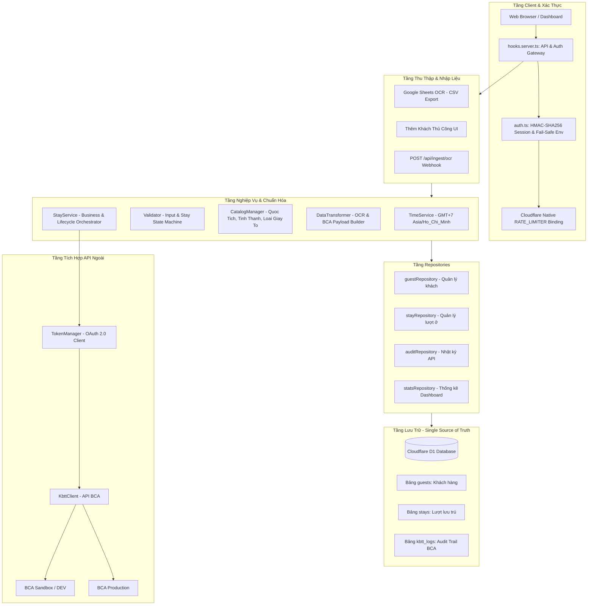
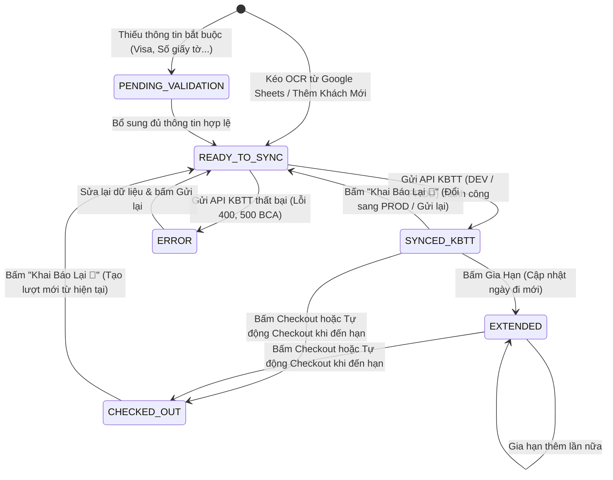
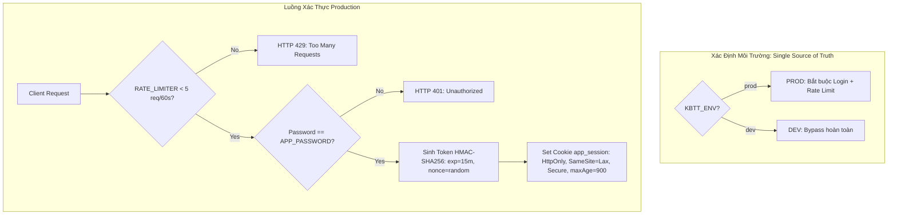

# Kiến Trúc Hệ Thống & Tài Liệu Kỹ Thuật (System Architecture & Technical Guide)

Tài liệu này mô tả toàn diện cấu trúc mã nguồn, mô hình dữ liệu Cloudflare D1, quy trình nghiệp vụ (Business Workflow), tích hợp API Khai Báo Tạm Trú (BCA KBTT API v1.4), cơ chế bảo mật xác thực (Authentication & Rate Limiting), và hướng dẫn phát triển mở rộng cho dự án **dang-ky-luu-tru**.

---

## 1. Tổng Quan Kiến Trúc (Architecture Overview)

Hệ thống hoạt động theo mô hình **SvelteKit 2 + Svelte 5 (Runes) + Cloudflare D1 (Serverless SQLite) + BCA KBTT API v1.4**.



---

## 2. Mô Hình Dữ Liệu Cloudflare D1 (Database Schema)

Cơ sở dữ liệu Cloudflare D1 là **Nguồn dữ liệu chân thực duy nhất (Single Source of Truth)**.

### 2.1. Bảng `guests` (Thông tin nhân thân khách hàng)
Lưu trữ thông tin hồ sơ khách hàng, phân tách độc lập với các lượt lưu trú để hỗ trợ khách quay lại nhiều lần.

| Tên Cột | Kiểu Dữ Liệu | Ràng Buộc | Ý Nghĩa / Ghi Chú |
|:---|:---|:---|:---|
| `id` | `TEXT` | `PRIMARY KEY` | UUID nhận diện khách hàng |
| `ho_ten` | `TEXT` | `NOT NULL` | Họ tên in hoa tiếng Việt hoặc quốc tế |
| `so_giay_to` | `TEXT` | `NOT NULL, UNIQUE` | Số CCCD (12 số giữ nguyên số 0 đầu) hoặc Hộ chiếu |
| `quoc_tich` | `TEXT` | `NOT NULL, DEFAULT 'VNM'` | Mã quốc gia Alpha-3 (VNM, USA, DEU, ARG...) |
| `loai_giay_to` | `TEXT` | `NOT NULL, DEFAULT 'CCCD'` | `CCCD`, `HO_CHIEU`, `CMND`, `THE_CAN_CUOC` |
| `ngay_sinh` | `TEXT` | | Định dạng `YYYY-MM-DD` |
| `gioi_tinh` | `TEXT` | `NOT NULL, DEFAULT 'M'` | `M` (Nam) hoặc `F` (Nữ) |
| `dia_chi_chi_tiet`| `TEXT` | | Địa chỉ đầy đủ (gồm cả xã, huyện, tỉnh) |
| `phuong_xa` | `TEXT` | | Tên hoặc mã Phường/Xã |
| `quan_huyen` | `TEXT` | | Tên hoặc mã Quận/Huyện |
| `tinh_thanh` | `TEXT` | | Tên hoặc mã Tỉnh/Thành phố |
| `created_at` | `TEXT` | `DEFAULT (datetime('now', '+7 hours'))` | Thời gian tạo (GMT+7) |
| `updated_at` | `TEXT` | `DEFAULT (datetime('now', '+7 hours'))` | Thời gian cập nhật (GMT+7) |

---

### 2.2. Bảng `stays` (Lượt lưu trú)
Quản lý trạng thái và vòng đời lưu trú của từng phòng và từng lượt khách.

| Tên Cột | Kiểu Dữ Liệu | Ràng Buộc | Ý Nghĩa / Ghi Chú |
|:---|:---|:---|:---|
| `id` | `TEXT` | `PRIMARY KEY` | UUID lượt lưu trú |
| `guest_id` | `TEXT` | `NOT NULL, FOREIGN KEY (guests.id)` | Liên kết tới hồ sơ khách hàng |
| `so_phong` | `TEXT` | `NOT NULL` | Số phòng (chuẩn hóa 1-9) |
| `ngay_den` | `TEXT` | `NOT NULL` | Định dạng `YYYY-MM-DD HH:mm:ss` (GMT+7) |
| `ngay_di_du_kien` | `TEXT` | `NOT NULL` | Định dạng `YYYY-MM-DD HH:mm:ss` (GMT+7) |
| `ngay_di_thuc_te` | `TEXT` | | Ghi nhận khi khách checkout thực tế |
| `thoi_han_thi_thuc`| `TEXT` | | Hạn thị thực/visa cho khách nước ngoài (`YYYY-MM-DD`) |
| `ly_do_luu_tru` | `INTEGER` | `DEFAULT 1` | 1: Du lịch, 2: Khác |
| `status` | `TEXT` | `NOT NULL, DEFAULT 'READY_TO_SYNC'` | Vòng đời trạng thái (xem mục 3) |
| `ma_ho_so_kbtt` | `TEXT` | | Mã hồ sơ trả về từ API BCA sau khi khai báo |
| `ghi_chu` | `TEXT` | | Ghi chú thêm cho lượt lưu trú |
| `source_sheet_tab`| `TEXT` | | Tên tab Google Sheet nạp dữ liệu vào |
| `source_sheet_row`| `INTEGER` | | Số dòng trong Google Sheet gốc |
| `created_at` | `TEXT` | `DEFAULT (datetime('now', '+7 hours'))` | Thời gian tạo (GMT+7) |
| `updated_at` | `TEXT` | `DEFAULT (datetime('now', '+7 hours'))` | Thời gian cập nhật (GMT+7) |

---

### 2.3. Bảng `kbtt_logs` (Nhật ký giao tiếp API BCA)
Lưu vết toàn bộ Request / Response JSON payload phục vụ đối soát, kiểm tra lỗi BCA và audit logs. Trong môi trường Production, nhật ký mang tính **Append-only** (không thể bị xóa từ UI).

| Tên Cột | Kiểu Dữ Liệu | Ràng Buộc | Ý Nghĩa |
|:---|:---|:---|:---|
| `id` | `TEXT` | `PRIMARY KEY` | UUID log entry |
| `stay_id` | `TEXT` | | ID lượt lưu trú liên quan |
| `api_endpoint` | `TEXT` | `NOT NULL` | `API_5_VN`, `API_4_NN`, `CHECKOUT_STAY`, `EXTEND_STAY`... |
| `guest_name` | `TEXT` | | Tên khách tại thời điểm gọi API |
| `so_giay_to` | `TEXT` | | CCCD / Hộ chiếu |
| `so_phong` | `TEXT` | | Số phòng |
| `request_payload` | `TEXT` | | Toàn bộ chuỗi JSON payload gửi lên BCA |
| `response_payload`| `TEXT` | | Toàn bộ chuỗi JSON phản hồi từ BCA |
| `is_success` | `INTEGER` | `DEFAULT 0` | 1: Thành công, 0: Thất bại |
| `error_message` | `TEXT` | | Chi tiết lỗi trích xuất được |
| `created_at` | `TEXT` | `DEFAULT (datetime('now', '+7 hours'))` | Thời gian ghi nhận (GMT+7) |

---

## 3. Vòng Đời Trạng Thái Lượt Lưu Trú (Stay Lifecycle State Machine)

Hệ thống quản lý trạng thái thông qua State Machine nghiêm ngặt tại `src/lib/server/validator.ts`:



---

## 4. Cơ Chế Xác Thực & Bảo Vệ Hệ Thống (Authentication & Security Architecture)

Hệ thống phân tách rõ ràng giữa **Authentication Dashboard** và **BCA OAuth Credentials**:



### 4.1. Quy tắc Xác định Môi trường (Environment Resolution)
- **Nguồn chân lý duy nhất**: Biến môi trường `KBTT_ENV` (`dev` | `prod`).
- **DEV (`KBTT_ENV=dev`)**: Tự động bypass toàn bộ xác thực và rate limiting khi chạy `pnpm run dev`.
- **PROD (`KBTT_ENV=prod`)**: Bắt buộc đăng nhập qua `APP_PASSWORD`. Tuyệt đối không suy diễn PROD dựa trên sự tồn tại của `platform.env`.

### 4.2. Kiến Trúc Token Không Trạng Thái (Stateless HMAC-SHA256 Session)
- **Cấu trúc Token**: `<payloadBase64>.<signatureBase64>`
  - `payload`: `{ exp: timestamp, iat: timestamp, nonce: "random_16bytes" }`.
  - `signature`: `HMAC-SHA256(secretKey, payloadBase64)` với secret phái sinh từ `APP_PASSWORD`.
- **Thời hạn TTL**: Cố định **15 phút** (`SESSION_TTL_SECONDS = 900`). Server kiểm tra `Date.now() > exp` trên từng request.
- **Bảo mật Cookie**: `HttpOnly`, `SameSite=Lax`, `Secure` trên HTTPS, `maxAge: 900` (loại bỏ hoàn toàn cookie tĩnh và cookie 30 ngày).

### 4.3. Cloudflare-Native Rate Limiting (`wrangler.json`)
- Tích hợp Cloudflare Rate Limiting binding `RATE_LIMITER` ở tầng Edge Network:
  ```json
  "ratelimits": [
    {
      "name": "RATE_LIMITER",
      "namespace_id": "1001",
      "simple": { "limit": 5, "period": 60 }
    }
  ]
  ```
- **Không dùng RAM in-memory Map** trong Worker isolate.
- Giới hạn 5 lần yêu cầu / 60 giây theo Client IP (`cf-connecting-ip`), trả về mã `HTTP 429`.

---

## 5. Cấu Trúc Thư Mục Dự Án (Project Structure)

```
.
├── .github/
│   └── workflows/
│       └── ci.yml                    # GitHub Actions CI Workflow (Biome, Svelte, Knip, Test, Build)
├── src/
│   ├── app.d.ts                      # Định nghĩa SvelteKit & Cloudflare Platform bindings (DB, RATE_LIMITER)
│   ├── hooks.server.ts               # Central API Gateway Auth, CSRF & Cookie security
│   ├── lib/
│   │   ├── components/               # Modular UI Components (Svelte 5 Runes & Callback Props)
│   │   │   ├── ConfirmModal.svelte   # Modal xác nhận hành động
│   │   │   └── StayStatusBadge.svelte# Badge hiển thị trạng thái lưu trú
│   │   ├── data/
│   │   │   └── catalogs.ts           # Dữ liệu tĩnh danh mục C06 (Zero-FS compatible)
│   │   ├── types/
│   │   │   └── index.ts              # Toàn bộ TypeScript interfaces & types của dự án
│   │   ├── utils/
│   │   │   └── format.ts             # Trích xuất formatting helpers, options, country resolvers
│   │   └── server/
│   │       ├── auth.ts               # Core authentication, HMAC session, timing-safe compare, rate limiter
│   │       ├── catalogManager.ts     # Tra cứu & chuẩn hóa Quốc tịch, Tỉnh thành, Loại giấy tờ
│   │       ├── config.ts             # Quản lý cấu hình .env (DEV/PROD URLs, Credentials)
│   │       ├── dataTransformer.ts    # Bóc tách OCR, chuẩn hóa ngày giờ GMT+7, validate payload
│   │       ├── db.ts                 # Database facade delegating to repositories
│   │       ├── googleSheetService.ts # Kéo CSV Google Sheets OCR, quét danh sách Tabs
│   │       ├── kbttClient.ts         # Client gọi API BCA v1.4 (API 4, API 5, API 12, OAuth2)
│   │       ├── logger.ts             # Ghi log chuẩn định dạng GMT+7
│   │       ├── stayService.ts        # Quản lý nghiệp vụ lưu trú (Ingest, Checkout, Extend, Re-register)
│   │       ├── syncPipeline.ts       # Pipeline điều phối đồng bộ
│   │       ├── time.ts               # Central GMT+7 Time Service
│   │       ├── tokenManager.ts       # Quản lý token OAuth 2.0 (tự động refresh khi hết hạn)
│   │       ├── validator.ts          # Central validation & Stay State Machine
│   │       └── repositories/         # Modular DB repositories
│   │           ├── auditRepository.ts# Nhật ký API BCA
│   │           ├── guestRepository.ts# Hồ sơ khách hàng
│   │           ├── index.ts          # Barrel file repositories
│   │           ├── statsRepository.ts# Thống kê Dashboard
│   │           └── stayRepository.ts # Lượt lưu trú & auto-checkout
│   └── routes/
│       ├── +page.svelte              # Giao diện chính (SPA conditional Auth Gate, 5 Tabs, Modals)
│       ├── +page.server.ts           # SSR load authenticated status
│       ├── +layout.svelte            # Layout khung giao diện
│       └── api/
│           ├── auth/login/           # POST (Login), GET (Session status), DELETE (Logout)
│           ├── catalogs/             # GET /api/catalogs
│           ├── env/                  # GET / POST /api/env
│           ├── ingest/ocr/           # POST /api/ingest/ocr (Webhook protected)
│           ├── logs/                 # GET /api/logs
│           ├── sheets/               # GET /api/sheets/tabs, GET /api/sheets/pull
│           ├── stats/                # GET /api/stats
│           ├── stays/                # GET / POST /api/stays
│           │   ├── [id]/+server.ts   # GET / PUT / DELETE /api/stays/[id]
│           │   ├── audit/            # GET / DELETE /api/stays/audit
│           │   ├── checkout/         # POST /api/stays/checkout
│           │   ├── extend/           # POST /api/stays/extend
│           │   ├── re-register/      # POST /api/stays/re-register
│           │   └── register/         # POST /api/stays/register
│           ├── token/                # GET /api/token
│           └── transform/            # POST /api/transform
├── test/
│   ├── unit/                         # Unit tests (Catalog, Transformer, Time, Validator, Svelte 5 anti-deprecation)
│   ├── api/                          # API security & authentication tests (HMAC session, Rate limit, Webhook, CSRF)
│   ├── integration/                  # D1 Database & StayService offline integration tests
│   ├── playwright-test.ts            # E2E test browser automation
│   └── live/                         # Live BCA pipeline tests (Manual / Opt-in)
├── wrangler.json                     # Cấu hình Cloudflare D1 & RATE_LIMITER binding
└── package.json                      # pnpm dependencies & scripts
```

---

## 6. Hướng Dẫn Phát Triển & Kiểm Thử (Developer & Testing Guide)

### 6.1. Thêm tính năng mới
1. Mọi truy vấn cơ sở dữ liệu mới phải được đặt trong thư mục `src/lib/server/repositories/`.
2. Mọi chuyển đổi trạng thái lưu trú phải tuân thủ State Machine trong `src/lib/server/validator.ts`.
3. Toàn bộ tính toán ngày giờ phải sử dụng `src/lib/server/time.ts`.
4. Giao diện UI viết theo chuẩn Svelte 5 (Runes `$state`, `$derived`, `$props`, Callback Props).
5. Mọi API gọi từ client phải đi qua wrapper bắt `401 Unauthorized` để tự động chuyển về màn hình đăng nhập.

### 6.2. Chạy quy trình kiểm tra chất lượng trước khi commit
```bash
# 1. Type-check Svelte & TypeScript
pnpm run check:svelte

# 2. Phân tích dead code & dependencies
pnpm run knip

# 3. Linter & Formatter Biome
pnpm run lint:biome

# 4. Chạy bộ kiểm thử tự động (100% offline)
pnpm test

# 5. Build kiểm tra bundle
pnpm run build

# 6. Cập nhật đồ thị kiến trúc
graphify . --code-only && graphify cluster-only .
```
