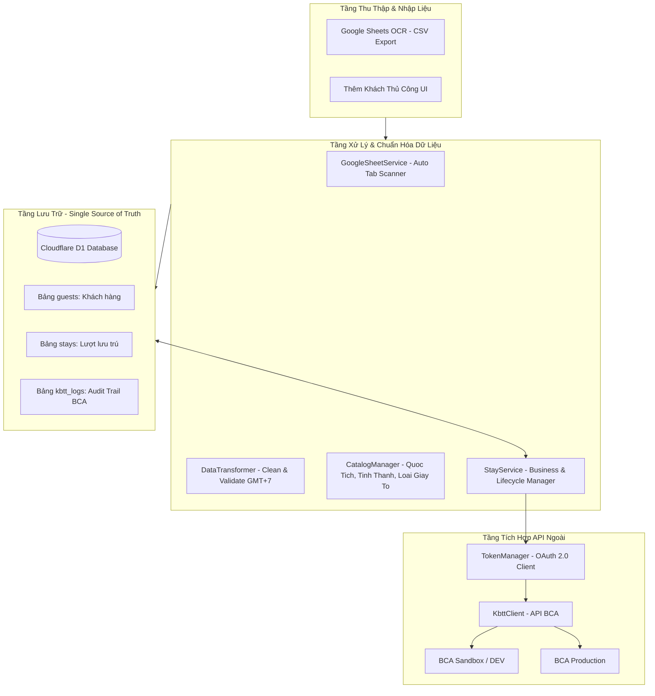
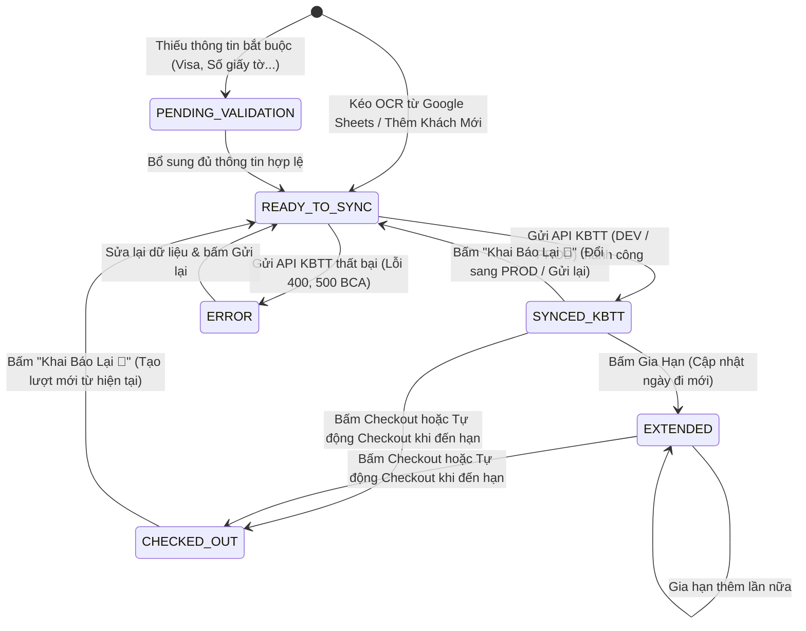

# Kiến Trúc Hệ Thống & Tài Liệu Kỹ Thuật (System Architecture & Technical Guide)

Tài liệu này mô tả toàn diện cấu trúc mã nguồn, mô hình dữ liệu Cloudflare D1, quy trình nghiệp vụ (Business Workflow), tích hợp API Khai Báo Tạm Trú (BCA KBTT API v1.4), và hướng dẫn phát triển mở rộng cho dự án **dang-ky-luu-tru**.

---

## 1. Tổng Quan Kiến Trúc (Architecture Overview)

Hệ thống hoạt động theo mô hình **SvelteKit 2 + Svelte 5 + Cloudflare D1 (Serverless SQLite) + BCA KBTT API v1.4**.



---

## 2. Mô Hình Dữ Liệu Cloudflare D1 (Database Schema)

Cơ sở dữ liệu Cloudflare D1 là **Nguồn dữ liệu chân thực duy nhất (Single Source of Truth)**.

### 2.1. Bảng `guests` (Thông tin nhân thân khách hàng)
Lưu trữ thông tin hồ sơ khách hàng, phân tách độc lập với các lượt lưu trú để hỗ trợ khách quay lại nhiều lần.

| Tên Cột | Kiểu Dữ Liệu | Ràng Buộc | Ý Nghĩa / Ghi Chú |
|:---|:---|:---|:---|
| `id` | `TEXT` | `PRIMARY KEY` | UUID nhận diện khách hàng |
| `ho_ten` | `TEXT` | `NOT NULL` | Họ tên in hoa tiếng Việt hoặc quốc tế |
| `so_giay_to` | `TEXT` | `NOT NULL, UNIQUE` | Số CCCD (12 số giữ nguyên số 0 đầu) hoặc Hộ chiếu |
| `quoc_tich` | `TEXT` | `NOT NULL, DEFAULT 'VNM'` | Mã quốc gia Alpha-3 (VNM, USA, DEU, ARG...) |
| `loai_giay_to` | `TEXT` | `NOT NULL, DEFAULT 'CCCD'` | `CCCD`, `HO_CHIEU`, `CMND`, `THE_CAN_CUOC` |
| `ngay_sinh` | `TEXT` | | Định dạng `YYYY-MM-DD` |
| `gioi_tinh` | `TEXT` | `NOT NULL, DEFAULT 'M'` | `M` (Nam) hoặc `F` (Nữ) |
| `dia_chi_chi_tiet`| `TEXT` | | Địa chỉ đầy đủ (gồm cả xã, huyện, tỉnh) |
| `phuong_xa` | `TEXT` | | Tên hoặc mã Phường/Xã |
| `quan_huyen` | `TEXT` | | Tên hoặc mã Quận/Huyện |
| `tinh_thanh` | `TEXT` | | Tên hoặc mã Tỉnh/Thành phố |
| `created_at` | `TEXT` | `DEFAULT (datetime('now', '+7 hours'))` | Thời gian tạo (GMT+7) |
| `updated_at` | `TEXT` | `DEFAULT (datetime('now', '+7 hours'))` | Thời gian cập nhật (GMT+7) |

---

### 2.2. Bảng `stays` (Lượt lưu trú)
Quản lý trạng thái và vòng đời lưu trú của từng phòng và từng lượt khách.

| Tên Cột | Kiểu Dữ Liệu | Ràng Buộc | Ý Nghĩa / Ghi Chú |
|:---|:---|:---|:---|
| `id` | `TEXT` | `PRIMARY KEY` | UUID lượt lưu trú |
| `guest_id` | `TEXT` | `NOT NULL, FOREIGN KEY (guests.id)` | Liên kết tới hồ sơ khách hàng |
| `so_phong` | `TEXT` | `NOT NULL` | Số phòng (chuẩn hóa 1-9) |
| `ngay_den` | `TEXT` | `NOT NULL` | Định dạng `YYYY-MM-DD HH:mm:ss` (GMT+7) |
| `ngay_di_du_kien` | `TEXT` | `NOT NULL` | Định dạng `YYYY-MM-DD HH:mm:ss` (GMT+7) |
| `ngay_di_thuc_te` | `TEXT` | | Ghi nhận khi khách checkout thực tế |
| `thoi_han_thi_thuc`| `TEXT` | | Hạn thị thực/visa cho khách nước ngoài (`YYYY-MM-DD`) |
| `ly_do_luu_tru` | `INTEGER` | `DEFAULT 1` | 1: Du lịch, 2: Khác |
| `status` | `TEXT` | `NOT NULL, DEFAULT 'READY_TO_SYNC'` | Vòng đời trạng thái (xem mục 3) |
| `ma_ho_so_kbtt` | `TEXT` | | Mã hồ sơ trả về từ API BCA sau khi khai báo |
| `ghi_chu` | `TEXT` | | Ghi chú thêm cho lượt lưu trú |
| `source_sheet_tab`| `TEXT` | | Tên tab Google Sheet nạp dữ liệu vào |
| `source_sheet_row`| `INTEGER` | | Số dòng trong Google Sheet gốc |
| `created_at` | `TEXT` | `DEFAULT (datetime('now', '+7 hours'))` | Thời gian tạo (GMT+7) |
| `updated_at` | `TEXT` | `DEFAULT (datetime('now', '+7 hours'))` | Thời gian cập nhật (GMT+7) |

---

### 2.3. Bảng `kbtt_logs` (Nhật ký giao tiếp API BCA)
Lưu vết toàn bộ Request / Response JSON payload phục vụ đối soát, kiểm tra lỗi BCA và audit logs.

| Tên Cột | Kiểu Dữ Liệu | Ràng Buộc | Ý Nghĩa |
|:---|:---|:---|:---|
| `id` | `TEXT` | `PRIMARY KEY` | UUID log entry |
| `stay_id` | `TEXT` | | ID lượt lưu trú liên quan |
| `api_endpoint` | `TEXT` | `NOT NULL` | `API_5_VN`, `API_4_NN`, `CHECKOUT_STAY`, `EXTEND_STAY`... |
| `guest_name` | `TEXT` | | Tên khách tại thời điểm gọi API |
| `so_giay_to` | `TEXT` | | CCCD / Hộ chiếu |
| `so_phong` | `TEXT` | | Số phòng |
| `request_payload` | `TEXT` | | Toàn bộ chuỗi JSON payload gửi lên BCA |
| `response_payload`| `TEXT` | | Toàn bộ chuỗi JSON phản hồi từ BCA |
| `is_success` | `INTEGER` | `DEFAULT 0` | 1: Thành công, 0: Thất bại |
| `error_message` | `TEXT` | | Chi tiết lỗi trích xuất được |
| `created_at` | `TEXT` | `DEFAULT (datetime('now', '+7 hours'))` | Thời gian ghi nhận (GMT+7) |

---

## 3. Vòng Đời Trạng Thái Lượt Lưu Trú (Stay Lifecycle State Machine)



### Chi tiết các trạng thái:
1. `READY_TO_SYNC` (**Sẵn sàng khai báo**): Dữ liệu đầy đủ, hợp lệ theo quy chuẩn BCA, sẵn sàng bấm nút gửi API.
2. `PENDING_VALIDATION` (**Cần bổ sung dữ liệu**): Bị thiếu trường bắt buộc (ví dụ: khách nước ngoài thiếu thời hạn visa, thiếu số phòng).
3. `ERROR` (**Lỗi khai báo**): Gửi lên API BCA nhưng bị từ chối (HTTP 400, HTTP 500 do sai định dạng hoặc lỗi nghiệp vụ BCA).
4. `SYNCED_KBTT` (**Đang lưu trú / Đã khai báo BCA**): Đã khai báo thành công, khách đang ở tại cơ sở lưu trú.
5. `EXTENDED` (**Đã gia hạn**): Đã cập nhật ngày đi dự kiến mới.
6. `CHECKED_OUT` (**Đã trả phòng**): Đã kết thúc lượt lưu trú, phòng được giải phóng.

---

## 4. Các Quy Chuẩn Nghiệp Vụ Quan Trọng (Critical Business Rules)

### 4.1. Múi Giờ Chuẩn GMT+7 (Asia/Ho_Chi_Minh)
- Toàn bộ thao tác tính toán ngày giờ hiện tại, ngày đi dự kiến, tab Google Sheet, và log audit đều sử dụng mốc **GMT+7** (`UTC + 7 hours`).
- Khi tạo lượt lưu trú mới:
  - `ngay_den` = Thời gian hiện tại GMT+7 (`YYYY-MM-DD HH:mm:ss`).
  - `ngay_di_du_kien` = Ngày hôm sau lúc 12:00:00 GMT+7 (`YYYY-MM-DD 12:00:00`).

### 4.2. Quy Tắc Validation & Điều Kiện Bắt Buộc
1. **Ngày đến (`ngay_den`)**: Bắt buộc là **Hôm nay hoặc Hôm qua** (không được ở tương lai, không được quá 1 ngày trong quá khứ).
2. **Khách Việt Nam (`quoc_tich === 'VNM'`)**:
   - `thoi_han_thi_thuc` phải để trống/vô hiệu hóa.
   - Sử dụng endpoint API 5: `/client-service/kbtt-vn/kbtt-3th`.
3. **Khách Nước Ngoài (`quoc_tich !== 'VNM'`)**:
   - `thoi_han_thi_thuc` **bắt buộc phải có** và phải lớn hơn hoặc bằng ngày đến (`ngay_den`).
   - Tuyệt đối **không tự ý fallback/giả lập** thời hạn visa. Nếu thiếu phải cảnh báo đỏ và ngăn không cho khai báo đến khi người dùng điền đủ.
   - Sử dụng endpoint API 4: `/client-service/kbtt/kbtt-3th`.
4. **Số CCCD**:
   - Giữ nguyên số 0 ở đầu (độ dài 12 ký tự số).
5. **Chống Gửi Bừa (Strict Pre-flight Check)**:
   - Nút **"Khai Báo"** và **"Khai Báo Tất Cả"** sẽ kiểm tra chéo toàn diện; nếu có bất kỳ bản ghi nào lỗi validation, hệ thống sẽ dừng ngay lập tức và yêu cầu chỉnh sửa.

---

## 5. Cấu Trúc Thư Mục Dự Án (Project Structure)

```
.
├── src/
│   ├── app.d.ts                      # Định nghĩa SvelteKit & Cloudflare Platform bindings
│   ├── lib/
│   │   └── server/
│   │       ├── catalogManager.ts     # Quản lý danh mục Tỉnh thành, Quốc tịch, Loại giấy tờ
│   │       ├── config.ts             # Quản lý cấu hình .env (DEV/PROD BCA URLs & Credentials)
│   │       ├── dataTransformer.ts    # Bóc tách OCR, chuẩn hóa ngày giờ GMT+7, validate payload
│   │       ├── db.ts                 # Tầng dữ liệu Cloudflare D1 (CRUD guests, stays, logs)
│   │       ├── googleSheetService.ts # Kéo CSV Google Sheets OCR, quét danh sách Tabs
│   │       ├── kbttClient.ts         # Client gọi API BCA v1.4 (API 4, API 5, OAuth2)
│   │       ├── logger.ts             # Bộ ghi nhật ký hệ thống GMT+7
│   │       ├── stayService.ts        # Quản lý nghiệp vụ lưu trú (Ingest, Checkout, Extend, Re-register)
│   │       ├── syncPipeline.ts       # Pipeline điều phối đồng bộ
│   │       └── tokenManager.ts       # Quản lý token OAuth 2.0 (tự động refresh khi hết hạn)
│   └── routes/
│       ├── +page.svelte              # Giao diện chính (5 Tabs, Modals, Optimistic UI)
│       ├── +layout.svelte            # Layout khung giao diện
│       └── api/
│           ├── auth/                 # Xác thực phiên làm việc
│           ├── catalogs/             # API tra cứu danh mục
│           ├── env/                  # API chuyển đổi môi trường DEV <-> PROD
│           ├── logs/                 # API nhật ký hệ thống
│           ├── sheets/               # API quét tabs & kéo dữ liệu Google Sheets
│           ├── stats/                # API thống kê số liệu Dashboard
│           ├── stays/                # API CRUD lượt lưu trú
│           │   ├── +server.ts        # GET / POST stays
│           │   ├── [id]/+server.ts   # GET / PUT / DELETE stay
│           │   ├── checkout/         # POST /api/stays/checkout
│           │   ├── extend/           # POST /api/stays/extend
│           │   ├── re-register/      # POST /api/stays/re-register
│           │   └── register/         # POST /api/stays/register (Gửi lên BCA)
│           └── token/                # API kiểm tra trạng thái token OAuth
├── data/
│   └── catalogs/                     # JSON danh mục chuẩn (quốc tịch, tỉnh thành, lý do)
├── migrations/
│   ├── 0001_initial_schema.sql       # Khởi tạo bảng guests, stays, kbtt_logs, indexes
│   ├── 0002_fix_stays_table.sql      # Cập nhật schema & indexes
│   └── 0003_add_missing_indexes.sql  # Tối ưu hóa chỉ mục tìm kiếm
├── test/
│   └── test-pipeline.ts              # Toàn bộ bài kiểm thử tự động Unit & Integration
├── wrangler.json                     # Cấu hình Cloudflare D1 & Workers deployment
└── package.json                      # pnpm dependencies & scripts
```

---

## 6. Hướng Dẫn Phát Triển & Mở Rộng Tính Năng (Developer Guide)

### 6.1. Thêm một trường mới vào Lượt lưu trú (Adding a New Field)
1. Tạo migration SQL trong thư mục `migrations/`:
   ```sql
   ALTER TABLE stays ADD COLUMN ten_truong_moi TEXT;
   ```
2. Cập nhật `interface Stay` và `interface StayDetail` trong [`src/lib/server/db.ts`](file:///home/hajtran/dev/dang-ky-luu-tru/src/lib/server/db.ts).
3. Cập nhật phương thức `upsertStay`, `getStays` trong `db.ts` và `updateGuestAndStay` trong [`src/lib/server/stayService.ts`](file:///home/hajtran/dev/dang-ky-luu-tru/src/lib/server/stayService.ts).
4. Cập nhật modal giao diện trong [`src/routes/+page.svelte`](file:///home/hajtran/dev/dang-ky-luu-tru/src/routes/+page.svelte).

### 6.2. Kiểm Thử Hệ Thống (Testing Pipeline)
Trước khi commit hoặc deploy, luôn chạy bộ kiểm thử chuẩn:
```bash
# 1. Format code
pnpm run format

# 2. Type-check Svelte & TypeScript
pnpm run check:svelte

# 3. Chạy toàn bộ Unit & Integration tests
pnpm test
```
