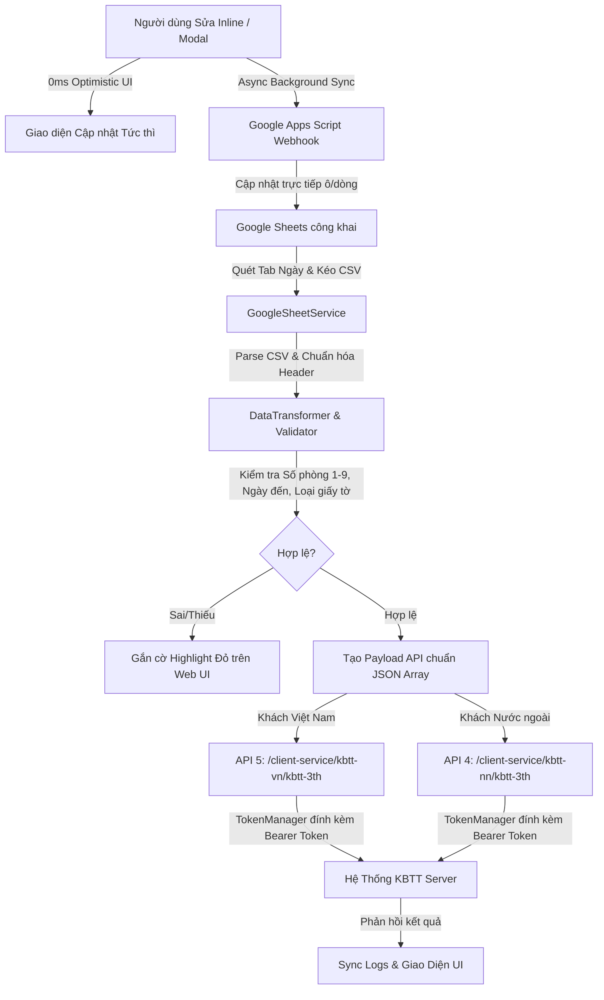

# Hệ Thống Tích Hợp & Đồng Bộ Khai Báo Lưu Trú (KBTT API v1.4)

Hệ thống tự động hóa đồng bộ dữ liệu khách lưu trú từ **Google Sheets (OCR)** sang **Hệ thống Quản lý Khai báo Tạm trú (KBTT)** theo chuẩn **API v1.4** (OAuth 2.0, API 4 Khách Nước ngoài, API 5 Khách Việt Nam), tích hợp hai chiều với Google Apps Script Webhook.

---

## 📌 Tình Trạng Hiện Tại (Current Status)

- **Chuẩn API**: Tuân thủ 100% đặc tả API v1.4 từ `https://api-kbtt.ai-vlab.com`.
- **Package Manager**: **`pnpm`** (Bắt buộc 100% cho mọi thao tác cài đặt và chạy script).
- **Cấu hình Môi trường**: Tách toàn bộ thông tin nhạy cảm vào `.env` & `.env.example`.
- **Chất Lượng Mã Nguồn & Kiểm Thử**:
  - `pnpm run lint`: Kiểm tra cú pháp toàn bộ codebase qua `node --check` (hoặc `svelte-check` / `tsc`).
  - `pnpm run knip`: Quản lý dependencies và loại bỏ dead code (0 issue).
  - `pnpm test`: Toàn bộ bộ kiểm thử tự động (Unit test, Validation, Live Sheet sync, OAuth token) đạt 100% Passed.
  - `pnpm run check`: Lệnh tổng hợp tự động (`lint` + `knip` + `test`).
- **Giao Diện & Trải Nghiệm (UI/UX)**:
  - Tone màu nền dịu mắt (`#edf2f7`), chống mỏi mắt.
  - **Focus Enlargement**: Khi focus vào ô nhập liệu inline, ô tự động phóng to (`scale-105 / 110`), viền rõ nét và đổ bóng nổi bật.
  - **Quick-Edit Modal**: Double click vào dòng hoặc bấm nút mở rộng $\nearrow$ để bung modal chỉnh sửa chi tiết toàn màn hình.
  - **Xử lý Địa chỉ Đầy đủ**: Hiển thị và chỉnh sửa chuỗi địa chỉ đầy đủ cách nhau bởi dấu phẩy (`[Địa chỉ chi tiết], [Phường/Xã], [Quận/Huyện], [Tỉnh/TP]`), tự động parse và map chuẩn vào từng cột Google Sheet.
  - **Đồng bộ 2 chiều tức thì (0ms Optimistic UI)**: Khi bấm Lưu / Checkbox / Modal Save, UI cập nhật tức thì 0ms latency và đồng bộ âm thầm với Google Apps Script Webhook trong nền.
  - **Xác thực Thông minh**: Tự động phát hiện ngày đến quá khứ, độ dài giấy tờ theo loại (CCCD 12 số, CMND 9 số, Hộ chiếu 6-12 ký tự), cross-check quốc tịch với `quoc_tich.json` (hỗ trợ cả các mã mở rộng như `VAA`).

---

## 🛠 Cấu Trúc Dự Án (Architecture)

```
.
├── .env                          # Biến môi trường cục bộ (tài khoản, endpoint, sheet id, webhook url)
├── .env.example                  # Mẫu cấu hình môi trường chuẩn
├── api-khai-bao-luu-tru-guide.md # Đặc tả & hướng dẫn chi tiết API KBTT v1.4
├── instruction.md                # Tài liệu hướng dẫn cài đặt Apps Script 2 chiều & script dọn dẹp
├── WORKFLOW_INSTRUCTION.md       # Quy chuẩn bắt buộc khi phát triển và kiểm thử
├── knip.json                     # Cấu hình kiểm tra dead code Knip
├── package.json                  # Cấu hình dự án & pnpm scripts
├── public/                       # Frontend Web UI
│   ├── index.html                # Giao diện chính (Data Table, Focus Zoom, Modal, Sync Logs, Catalog)
│   └── app.js                    # Client logic, Quick-Edit Modal, Address Parser, 0ms Optimistic Sync
├── src/                          # Backend Services (Node.js ESM)
│   ├── config.js                 # Bộ nạp .env tự động, Endpoint, Credential OAuth
│   ├── catalogManager.js         # Quản lý danh mục quốc tịch, tỉnh thành, loại giấy tờ, lý do lưu trú
│   ├── tokenManager.js           # Quản lý vòng đời OAuth 2.0 Access Token (Login, Refresh, Revoke)
│   ├── dataTransformer.js        # Chuẩn hóa dữ liệu OCR & validate payload API 4/5
│   ├── googleSheetService.js     # Kéo CSV công khai, quét tab ngày, gửi Webhook Apps Script cập nhật 2 chiều
│   ├── kbttClient.js             # Client gửi HTTP request payload chuẩn JSON Array [...]
│   ├── syncPipeline.js           # Pipeline điều phối Kéo -> Lọc -> Chuẩn hóa -> Đẩy API -> Ghi log
│   ├── server.js                 # HTTP Server & Server-Sent Events (SSE) Hot-Reload & Sheet Proxy
│   └── index.js                  # Entry point chạy đồng bộ CLI
├── test/
│   └── test-pipeline.js          # Bộ kiểm thử tự động toàn diện
└── graphify-out/                 # Knowledge Graph trích xuất mã nguồn
```

---

## 📋 Danh Sách Chức Năng Chi Tiết (Feature Matrix)

| Chức Năng | Mô Tả & Cơ Chế Hoạt Động | Trạng Thái |
|:---|:---|:---:|
| **Quét & Kéo Tab Google Sheets** | Tự động phân tích HTML Google Sheets công khai, nhận diện tất cả các tab ngày (dd-MM-yy), tự động chọn tab gần hôm nay nhất. | ✅ Sẵn sàng |
| **Bóc tách & Chuẩn hóa OCR** | Làm sạch số phòng (chuẩn hóa 1-9), bóc tách họ tên in hoa, định dạng ngày `YYYY-MM-DD HH:mm:ss`, xác định nhánh khách VN (API 5) hay Nước ngoài (API 4). | ✅ Sẵn sàng |
| **Xác thực Giấy tờ & Quốc tịch** | Kiểm tra độ dài giấy tờ theo từng loại (CCCD 12 số, CMND 9 số, Hộ chiếu 6-12 ký tự), đối chiếu mã quốc tịch 3 ký tự (hỗ trợ VAA, VNM, RUS,...). | ✅ Sẵn sàng |
| **Chặn Ngày đến Quá khứ** | Bắt buộc ngày đến chỉ là **hôm nay** hoặc **hôm qua**. Cảnh báo đỏ nếu ngày đến quá cũ hoặc trong tương lai. | ✅ Sẵn sàng |
| **Quản lý Token OAuth 2.0** | Tự động đăng nhập lấy Bearer token, tự động làm mới khi token còn dưới 60s, tự động thu hồi khi hoàn tất batch. | ✅ Sẵn sàng |
| **Chỉnh sửa Inline & Phóng to Focus** | Các input trong bảng tự động phóng to `scale-105` khi click/focus, giúp nhập liệu nhanh không bị mỏi mắt. | ✅ Sẵn sàng |
| **Modal Quick-Edit toàn diện** | Double-click hoặc bấm nút $\nearrow$ để mở modal giữa màn hình, hiển thị toàn bộ trường với kích thước lớn, dễ quan sát. | ✅ Sẵn sàng |
| **Biên tập Full Địa chỉ có Dấu phẩy** | Hiển thị chuỗi địa chỉ đầy đủ; khi sửa sẽ tự động phân tách về `Địa chỉ chi tiết`, `Phường/Xã`, `Quận/Huyện`, `Tỉnh/TP` và map lên Google Sheet. | ✅ Sẵn sàng |
| **Đồng bộ 2 Chiều Google Sheets (0ms)** | Khi sửa trên UI, áp dụng Optimistic UI tức thì (0ms) và gọi Google Apps Script Webhook trong nền để cập nhật thẳng vào dòng trên Sheet. | ✅ Sẵn sàng |
| **Tra cứu Danh mục Tức thì** | Catalog browser tra cứu nhanh Tỉnh/TP, Quốc tịch (hỗ trợ gõ tiếng Việt không dấu), click copy mã 1 chạm. | ✅ Sẵn sàng |
| **Tự động Dọn dẹp & Resize Sheet** | Tích hợp code Apps Script tự động giữ 5 sheet gần nhất và tự động auto-fit column có padding chống che chữ mỗi phút. | ✅ Sẵn sàng |

---

## 🔄 Quy Trình Vận Hành & Đồng Bộ (Workflow)



---

## 🚀 Lộ Trình Nâng Cấp (Roadmap)

- [x] **Giai đoạn 1**: Xây dựng kiến trúc module Node.js ESM thuần, chuẩn hóa API 4/5 theo đặc tả v1.4.
- [x] **Giai đoạn 2**: Tích hợp quét tab ngày tự động từ Google Sheet và kiểm tra mã quốc tịch mở rộng.
- [x] **Giai đoạn 3**: Triển khai đồng bộ 2 chiều với Google Apps Script Webhook, 0ms Optimistic UI.
- [x] **Giai đoạn 4**: Tách biến môi trường `.env`, nâng cấp giao diện Focus Zoom, Quick-Edit Modal và bóc tách Địa chỉ đầy đủ theo dấu phẩy.
- [ ] **Giai đoạn 5 (Hiện tại)**: **Nâng cấp toàn bộ dự án lên SvelteKit + TypeScript**
  - Chuyển đổi toàn bộ Backend Services (`src/`) sang TypeScript modules (`src/lib/server/`).
  - Chuyển đổi Web UI sang Svelte 5 / SvelteKit Components (`src/routes/`), quản lý state mượt mà với Svelte reactivity.
  - Tích hợp Type-safe API endpoints (`/api/sheets`, `/api/sync`, `/api/catalogs`, `/api/transform`).
  - Giữ vững quy trình kiểm tra chất lượng theo [WORKFLOW_INSTRUCTION.md](file:///home/hajtran/dev/dang-ky-luu-tru/WORKFLOW_INSTRUCTION.md) (`pnpm check`, `graphify`).
- [ ] **Giai đoạn 6**: Bổ sung cơ chế auto-polling định kỳ theo cron job, thông báo trạng thái qua Telegram Bot / Webhook.

---

## ⚙️ Hướng Dẫn Cài Đặt & Sử Dụng

### 1. Cài đặt môi trường
```bash
# Cài đặt dependencies bằng pnpm
pnpm install

# Sao chép và cấu hình biến môi trường
cp .env.example .env
```

### 2. Khởi động môi trường phát triển
```bash
pnpm run dev
```
Truy cập `http://localhost:3000` trên trình duyệt.

### 3. Quy trình Kiểm thử Bắt buộc (Mandatory Verification)
```bash
# Chạy toàn bộ kiểm tra chất lượng
pnpm run check

# Cập nhật Knowledge Graph
graphify . --code-only && graphify cluster-only .
```
