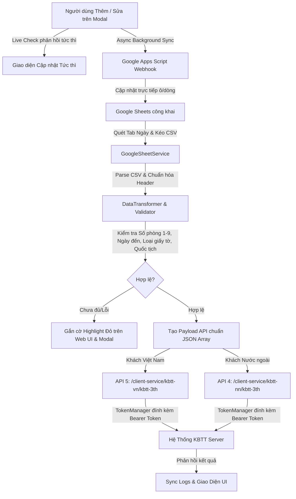

# Hệ Thống Tích Hợp & Đồng Bộ Khai Báo Lưu Trú (KBTT API v1.4)

Hệ thống tự động hóa đồng bộ dữ liệu khách lưu trú từ **Google Sheets (OCR)** sang **Hệ thống Quản lý Khai báo Tạm trú (KBTT)** theo chuẩn **API v1.4** (OAuth 2.0, API 4 Khách Nước ngoài, API 5 Khách Việt Nam), tích hợp hai chiều với Google Apps Script Webhook trên nền tảng **SvelteKit 2 + Svelte 5 + TypeScript**.

---

## 📌 Tình Trạng Hiện Tại (Current Status)

- **Framework**: **SvelteKit 2 + Svelte 5 (Runes) + TypeScript + Tailwind CSS**.
- **Chuẩn API**: Tuân thủ 100% đặc tả API v1.4 từ `https://api-kbtt.ai-vlab.com`.
- **Package Manager**: **`pnpm`** (Bắt buộc 100% cho mọi thao tác cài đặt và chạy script).
- **Cấu hình Môi trường**: Tách toàn bộ thông tin nhạy cảm vào `.env` & `.env.example`.
- **Chất Lượng Mã Nguồn & Kiểm Thử**:
  - `pnpm run check:svelte`: Type-check & template diagnostic qua `svelte-check`.
  - `pnpm run knip`: Quản lý dependencies và loại bỏ dead code (0 issue).
  - `pnpm run format` / `pnpm run lint:biome`: Format & lint chuẩn mực với Biome.
  - `pnpm test`: Toàn bộ bộ kiểm thử tự động (Unit test, Validation, Live Sheet sync, OAuth token) đạt 100% Passed.
  - `pnpm run check`: Lệnh tổng hợp tự động (`check:svelte` + `knip` + `test`).
- **Giao Diện & Trải Nghiệm (UI/UX)**:
  - **Quick-Edit Modal với Live Check thời gian thực**: Khi mở modal, các trường lỗi được viền đỏ nổi bật kèm thông báo hướng dẫn. Khi người dùng nhập đúng, viền đỏ và cảnh báo tự động biến mất tức thì (0ms latency).
  - **Xác thực Đa Định Dạng Ngày Đến**: Hỗ trợ chuẩn xác cả định dạng Việt Nam (`DD/MM/YYYY HH:mm:ss`, `DD-MM-YYYY`) và chuẩn ISO (`YYYY-MM-DD HH:mm:ss`), giữ nguyên giờ phút thực tế.
  - **Đối chiếu Mã Quốc Tịch Mở Rộng**: Tự động nhận diện và chuyển đổi tên quốc gia/từ viết tắt (Việt Nam, VN, China, Russia, USA, Korea, Japan, Taiwan, Germany,...) sang mã Alpha-3 chuẩn API và cross-check với danh mục `quoc_tich.json`.
  - **Lọc Danh mục Lý Do Cư Trú (API 9)**: Tinh gọn chỉ giữ 2 mục thiết yếu: *Du lịch (1)* và *Mục đích khác (20)*.
  - **Thao tác 1 chạm**: Nút "Thêm khách" tự động chèn dòng mới, bung modal nhập liệu và đồng bộ lên Google Sheet; nút "Đăng ký (X/Y hoặc Tất cả)" điều phối gửi dữ liệu thông minh.
  - **Đồng bộ 2 chiều tức thì (0ms Optimistic UI)**: Khi bấm Lưu / Checkbox / Modal Save, UI cập nhật tức thì 0ms latency và đồng bộ âm thầm với Google Apps Script Webhook trong nền.

---

## 🛠 Cấu Trúc Dự Án (Architecture)

```
.
├── .env                              # Biến môi trường cục bộ (tài khoản, endpoint, sheet id, webhook url)
├── .env.example                      # Mẫu cấu hình môi trường chuẩn
├── api-khai-bao-luu-tru-guide.md     # Đặc tả & hướng dẫn chi tiết API KBTT v1.4
├── instruction.md                    # Tài liệu hướng dẫn cài đặt Apps Script 2 chiều & script dọn dẹp
├── WORKFLOW_INSTRUCTION.md           # Quy chuẩn bắt buộc khi phát triển và kiểm thử
├── knip.json                         # Cấu hình kiểm tra dead code Knip
├── biome.json                        # Cấu hình linter & formatter Biome
├── tsconfig.json                     # Cấu hình TypeScript & SvelteKit aliases
├── package.json                      # Cấu hình dự án & pnpm scripts
├── data/
│   └── catalogs/                     # Bộ nhớ đệm danh mục chuẩn (quốc tịch, tỉnh thành, lý do, giấy tờ)
├── src/
│   ├── lib/
│   │   └── server/                   # Backend Type-Safe Services (TypeScript)
│   │       ├── config.ts             # Bộ nạp .env tự động, Endpoint, Credential OAuth
│   │       ├── catalogManager.ts     # Quản lý danh mục, alias quốc gia, lọc lý do cư trú
│   │       ├── tokenManager.ts       # Quản lý vòng đời OAuth 2.0 Access Token
│   │       ├── dataTransformer.ts    # Chuẩn hóa dữ liệu OCR, parse ngày đa định dạng & validate payload API 4/5
│   │       ├── googleSheetService.ts # Quét Tab ngày, kéo CSV công khai, gửi Webhook Apps Script
│   │       ├── kbttClient.ts         # Client gửi HTTP request payload chuẩn JSON Array [...]
│   │       └── syncPipeline.ts       # Pipeline điều phối Kéo -> Lọc -> Chuẩn hóa -> Đẩy API -> Ghi log
│   └── routes/                       # SvelteKit Endpoints & UI Pages
│       ├── +page.svelte              # Giao diện chính (Data Table, Live-check Modal, Sync Logs, Catalog Browser)
│       └── api/                      # RESTful API Endpoints cho Frontend
│           ├── sheets/               # Quét tabs (/tabs), Kéo dữ liệu (/pull), Ghi đè dòng (/update-row)
│           ├── catalogs/             # Lấy danh mục chuẩn phục vụ UI
│           ├── token/                # Trạng thái & làm mới OAuth token
│           ├── transform/            # Chuyển đổi & kiểm tra tính hợp lệ dữ liệu
│           ├── sync/                 # Đẩy dữ liệu lên CSDL KBTT
│           └── events/               # Server-Sent Events (SSE)
├── test/
│   └── test-pipeline.ts              # Bộ kiểm thử tự động toàn diện
└── graphify-out/                     # Knowledge Graph trích xuất mã nguồn
```

---

## 📋 Danh Sách Chức Năng Chi Tiết (Feature Matrix)

| Chức Năng | Mô Tả & Cơ Chế Hoạt Động | Trạng Thái |
|:---|:---|:---:|
| **Quét & Kéo Tab Google Sheets** | Tự động phân tích HTML Google Sheets công khai, nhận diện tất cả các tab ngày (dd-MM-yy), tự động chọn tab gần hôm nay nhất. | ✅ Sẵn sàng |
| **Bóc tách & Chuẩn hóa OCR** | Làm sạch số phòng (chuẩn hóa 1-9), bóc tách họ tên in hoa, định dạng ngày đa chuẩn (`DD/MM/YYYY HH:mm:ss`, `YYYY-MM-DD`), phân loại khách VN (API 5) / Nước ngoài (API 4). | ✅ Sẵn sàng |
| **Cross-check Quốc tịch Đa tầng** | Tự động phân giải tên nước (Việt Nam, Nga, Mỹ, Trung Quốc, Hàn Quốc,...) sang mã Alpha-3 và kiểm tra tính hợp lệ qua `quoc_tich.json`. | ✅ Sẵn sàng |
| **Chặn Ngày đến Quá khứ** | Bắt buộc ngày đến chỉ là **hôm nay** hoặc **hôm qua**. Cảnh báo đỏ nếu ngày đến quá cũ (> 1 ngày trước) hoặc trong tương lai. | ✅ Sẵn sàng |
| **Quick-Edit Modal với Live Check** | Modal chỉnh sửa toàn màn hình; kiểm tra tính hợp lệ từng trường ngay khi gõ phím, tự động xóa viền đỏ khi nhập đúng. | ✅ Sẵn sàng |
| **Biên tập Full Địa chỉ có Dấu phẩy** | Hiển thị chuỗi địa chỉ đầy đủ; khi sửa sẽ tự động phân tách về `Địa chỉ chi tiết`, `Phường/Xã`, `Quận/Huyện`, `Tỉnh/TP` và map lên Google Sheet. | ✅ Sẵn sàng |
| **Đồng bộ 2 Chiều Google Sheets (0ms)** | Khi sửa trên UI hoặc Thêm khách, áp dụng Optimistic UI tức thì (0ms) và gọi Google Apps Script Webhook trong nền để cập nhật dòng trên Sheet. | ✅ Sẵn sàng |
| **Tra cứu Danh mục Tức thì** | Catalog browser tra cứu nhanh Tỉnh/TP, Quốc tịch (hỗ trợ gõ tiếng Việt không dấu), click copy mã 1 chạm. | ✅ Sẵn sàng |
| **Tự động Dọn dẹp & Resize Sheet** | Tích hợp code Apps Script tự động giữ 5 sheet gần nhất và tự động auto-fit column có padding chống che chữ mỗi phút. | ✅ Sẵn sàng |

---

## 🔄 Quy Trình Vận Hành & Đồng Bộ (Workflow)



---

## 🚀 Lộ Trình Nâng Cấp (Roadmap)

- [x] **Giai đoạn 1**: Xây dựng kiến trúc module Node.js ESM thuần, chuẩn hóa API 4/5 theo đặc tả v1.4.
- [x] **Giai đoạn 2**: Tích hợp quét tab ngày tự động từ Google Sheet và kiểm tra mã quốc tịch mở rộng.
- [x] **Giai đoạn 3**: Triển khai đồng bộ 2 chiều với Google Apps Script Webhook, 0ms Optimistic UI.
- [x] **Giai đoạn 4**: Tách biến môi trường `.env`, nâng cấp giao diện Focus Zoom, Quick-Edit Modal và bóc tách Địa chỉ đầy đủ theo dấu phẩy.
- [x] **Giai đoạn 5**: **Nâng cấp toàn bộ dự án lên SvelteKit 2 + Svelte 5 + TypeScript**
  - Chuyển đổi toàn bộ Backend Services sang TypeScript modules (`src/lib/server/`).
  - Giao diện Svelte 5 Runes reactivity với Live Validation, Modal chỉnh sửa nhanh, bỏ pop-out icon thừa.
  - Tích hợp Type-safe API endpoints (`/api/sheets`, `/api/sync`, `/api/catalogs`, `/api/transform`, `/api/token`).
  - Cross-check mã quốc tịch chuẩn xác từ `quoc_tich.json` và làm sạch danh mục lý do cư trú (2 lý do).
- [ ] **Giai đoạn 6**: Bổ sung cơ chế auto-polling định kỳ theo cron job, thông báo trạng thái qua Telegram Bot / Webhook.

---

## ⚙️ Hướng Dẫn Cài Đặt & Sử Dụng

### 1. Cài đặt môi trường
```bash
# Cài đặt dependencies bằng pnpm
pnpm install

# Sao chép và cấu hình biến môi trường
cp .env.example .env
```

### 2. Khởi động môi trường phát triển
```bash
pnpm run dev
```
Truy cập `http://localhost:3000` trên trình duyệt.

### 3. Quy trình Kiểm thử Bắt buộc (Mandatory Verification)
```bash
# Kiểm tra types, dead code và chạy unit tests
pnpm run check

# Cập nhật Knowledge Graph
graphify . --code-only && graphify cluster-only .
```

