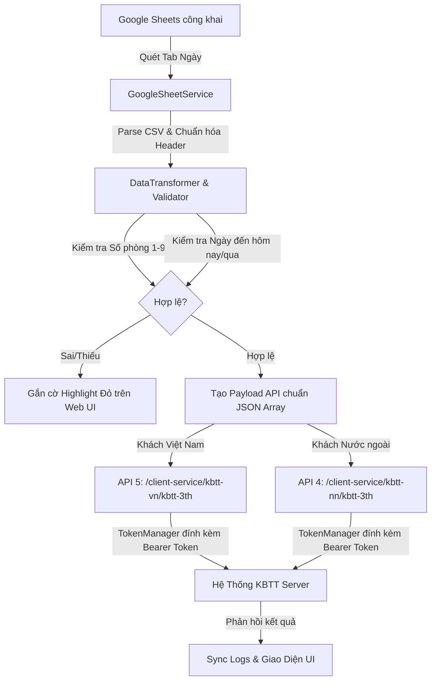

# Hệ Thống Tích Hợp & Đồng Bộ Khai Báo Lưu Trú (KBTT API v1.4)

Hệ thống tự động hóa đồng bộ dữ liệu khách lưu trú từ **Google Sheets (OCR)** sang **Hệ thống Quản lý Khai báo Tạm trú (KBTT)** theo chuẩn **API v1.4** (OAuth 2.0, API 4 Khách Nước ngoài, API 5 Khách Việt Nam).

---

## 📌 Tình Trạng Hiện Tại (Current Status)

- **Chuẩn API**: Tuân thủ đặc tả API v1.4 từ `https://api-kbtt.ai-vlab.com`.
- **Package Manager**: **`pnpm`** (100% không dùng `npm` hay `yarn`).
- **Chất Lượng Mã Nguồn & Kiểm Thử**:
  - `pnpm run lint`: Kiểm tra cú pháp toàn bộ file qua `node --check`.
  - `pnpm run knip`: Quản lý dependencies và dead code qua `knip` (0 issue).
  - `pnpm test`: Toàn bộ 7 suite kiểm thử unit test & live test đạt 100% Passed.
  - `pnpm run check`: Lệnh tổng hợp (`lint` + `knip` + `test`).
- **Giao Diện & Trải Nghiệm (UI/UX)**:
  - Nền màu dịu mắt (`#edf2f7`), giảm chói lóa.
  - Tiêu đề cột: **Phòng** (đã bỏ các ký tự `*` thừa).
  - Cột phòng hiển thị thuần túy số phòng `{number}` (1 đến 9). Khi chỉnh sửa, dropdown chỉ hiển thị các giá trị `1` đến `9`.
  - Cột giới tính hiển thị thuần túy **`Nam`** / **`Nữ`**.
  - Tự động highlight ô bị thiếu/sai (ví dụ số phòng không thuộc 1-9, ngày đến quá khứ) với viền đỏ và icon cảnh báo.
  - Hỗ trợ chọn Tab ngày tự động quét từ Google Sheet (mặc định chọn tab gần với ngày hôm nay nhất).

---

## 🛠 Cấu Trúc Dự Án (Architecture)

```
.
├── api-khai-bao-luu-tru-guide.md # Đặc tả & hướng dẫn chi tiết API KBTT v1.4
├── instruction.md                # Yêu cầu cập nhật của người dùng
├── knip.json                     # Cấu hình kiểm tra dead code Knip
├── package.json                  # Cấu hình dự án & pnpm scripts
├── public/                       # Frontend Web UI (Vanilla JS & Tailwind CDN)
│   ├── index.html                # Giao diện chính (3 tab: OCR Data, Sync Logs, Catalog)
│   └── app.js                    # Logic client, tương tác bảng, validate, SSE Hot-Reload
├── src/                          # Backend Services (Node.js ESM)
│   ├── config.js                 # Biến môi trường, Endpoint, Credential OAuth
│   ├── catalogManager.js         # Danh mục quốc tịch, tỉnh thành, loại giấy tờ, lý do lưu trú
│   ├── tokenManager.js           # Quản lý vòng đời OAuth 2.0 Access Token
│   ├── dataTransformer.js        # Chuẩn hóa dữ liệu OCR & validate payload API 4/5
│   ├── googleSheetService.js     # Kéo CSV công khai & quét tự động các tab ngày
│   ├── kbttClient.js             # Client gửi HTTP request payload chuẩn JSON Array [...]
│   ├── syncPipeline.js           # Pipeline kéo -> lọc -> chuẩn hóa -> đẩy API -> ghi log
│   ├── server.js                 # HTTP Server & Server-Sent Events (SSE) Hot-Reload
│   └── index.js                  # Entry point chạy đồng bộ CLI
├── test/
│   └── test-pipeline.js          # Bộ kiểm thử tự động toàn diện
└── graphify-out/                 # Knowledge Graph trích xuất mã nguồn
```

---

## 🔄 Quy Trình Vận Hành & Đồng Bộ (Workflow)



### Các bước vận hành thực tế:
1. **Khởi động server phát triển**:
   ```bash
   pnpm run dev
   ```
   Truy cập `http://localhost:3000` trên trình duyệt. Server hỗ trợ **SSE Hot-Reload** khi sửa code.

2. **Chọn Tab và Kéo dữ liệu**:
   - Chọn tab ngày trên thanh điều khiển (hệ thống tự động chọn tab gần nhất).
   - Bấm **"Kéo Dữ Liệu Tab"** để xem và kiểm tra tính hợp lệ trước khi gửi.
   - Nhấp **"Sửa"** trên dòng nếu cần chỉnh số phòng (`1`-`9`), họ tên, hoặc số giấy tờ.

3. **Gửi dữ liệu lên CSDL Lưu Trú**:
   - Chọn các dòng cần khai báo rồi bấm **"Push đăng ký đã chọn"**, hoặc bấm **"Push tất cả"**.
   - Bấm **"Đồng Bộ Luôn"** để tự động kéo tab mới nhất và đẩy thẳng các bản ghi hợp lệ.

4. **Kiểm tra mã nguồn & Kiểm thử trước khi release**:
   ```bash
   pnpm run check
   ```

---

## ⚙️ Quy Tắc Chuẩn Hóa Dữ Liệu (Payload Rules)

1. **Gói tin luôn là JSON Array `[...]`** có header `Authorization: Bearer <AccessToken>`.
2. **Số phòng (`soPhong`)**:
   - Trên Frontend hiển thị: Cột `Phòng`, giá trị `{number}` (ví dụ: `1`, `7`). Dropdown edit chọn `1` đến `9`.
   - Trong JSON gửi lên API: Định dạng chuỗi `"Phong so {number}"` (ví dụ: `"Phong so 7"`).
3. **Giới tính (`gioiTinh`)**:
   - Frontend hiển thị: `Nam` / `Nữ`.
   - API JSON: `"M"` hoặc `"F"`.
4. **Địa chỉ (`diaChi`)**:
   - Khách có Hộ chiếu / Nước ngoài: Luôn để rỗng `""`.
   - Khách CCCD/CMND: Ghép dạng `"[Địa chỉ], [Phường/Xã], [Quận/Huyện], [Tỉnh]"`, mã `maTT` và `maPX` để `""`.
5. **Ngày đến (`ngayDenCsltStr`)**:
   - Bắt buộc là **ngày hôm nay** hoặc **ngày hôm qua**. Nếu ngày đến ở quá khứ xa hoặc tương lai, hệ thống tự động chặn và báo đỏ trên giao diện trước khi gửi.
6. **Lý do lưu trú (`lyDoCuTru`)**: Mặc định là `1` (Du lịch) hoặc `20` (Mục đích khác).
