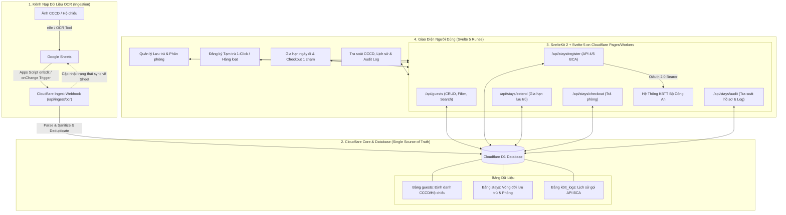

# Kế Hoạch Triển Khai & Danh Sách Nhiệm Vụ (Implementation Plan & Tasks)
## Chuyển Đổi Hệ Thống Sang Kiến Trúc Cloudflare-Native Database (Single Source of Truth)

---

## 🏗 1. Kiến Trúc Hệ Thống Mục Tiêu (Target Architecture)

---

## 🗄 2. Thiết Kế Cơ Sở Dữ Liệu (Cloudflare D1 Database Schema)

### 2.1. Bảng `guests` (Hồ sơ cá nhân & Định danh)
- `id` (TEXT / UUID, PRIMARY KEY)
- `loai_giay_to` (TEXT: `CCCD`, `HO_CHIEU`, `CMND`, etc.)
- `so_giay_to` (TEXT, NOT NULL, INDEX: Bắt buộc chuỗi, giữ nguyên số 0 đầu)
- `ho_ten` (TEXT, NOT NULL: Chuỗi in hoa chuẩn)
- `ngay_sinh` (TEXT: `YYYY-MM-DD` hoặc `DD/MM/YYYY`)
- `gioi_tinh` (TEXT: `M`, `F`)
- `quoc_tich` (TEXT, DEFAULT `VNM`: Mã Alpha-3 chuẩn KBTT)
- `dia_chi_chi_tiet` (TEXT)
- `phuong_xa` (TEXT)
- `quan_huyen` (TEXT)
- `tinh_thanh` (TEXT)
- `created_at` (DATETIME, DEFAULT CURRENT_TIMESTAMP)
- `updated_at` (DATETIME, DEFAULT CURRENT_TIMESTAMP)

### 2.2. Bảng `stays` (Lượt lưu trú & Quản lý trạng thái)
- `id` (TEXT / UUID, PRIMARY KEY)
- `guest_id` (TEXT, FOREIGN KEY -> `guests.id`)
- `so_phong` (TEXT, NOT NULL, INDEX)
- `ngay_den` (TEXT, NOT NULL: `YYYY-MM-DD HH:mm:ss`)
- `ngay_di_du_kien` (TEXT: `YYYY-MM-DD`)
- `ngay_di_thuc_te` (TEXT, NULLABLE)
- `ly_do_luu_tru` (INTEGER, DEFAULT 1)
- `status` (TEXT: `PENDING_VALIDATION`, `READY_TO_SYNC`, `SYNCED_KBTT`, `EXTENDED`, `CHECKED_OUT`, `CANCELLED`)
- `ma_ho_so_kbtt` (TEXT, NULLABLE: Mã trả về từ API 4 / API 5)
- `source_sheet_tab` (TEXT, NULLABLE: Tên tab ngày OCR)
- `source_sheet_row` (INTEGER, NULLABLE: Số dòng trên sheet gốc)
- `created_at` (DATETIME, DEFAULT CURRENT_TIMESTAMP)
- `updated_at` (DATETIME, DEFAULT CURRENT_TIMESTAMP)
- **Ràng buộc duy nhất**: `UNIQUE(guest_id, ngay_den)` để chặn trùng lặp lượt khai báo.

### 2.3. Bảng `kbtt_logs` (Audit Trail & Giải trình thanh tra)
- `id` (TEXT / UUID, PRIMARY KEY)
- `stay_id` (TEXT, FOREIGN KEY -> `stays.id`)
- `api_endpoint` (TEXT: `API_4_NN`, `API_5_VN`, `API_12_CHECKOUT`, etc.)
- `request_payload` (TEXT / JSON)
- `response_payload` (TEXT / JSON)
- `http_status` (INTEGER)
- `is_success` (BOOLEAN)
- `error_message` (TEXT, NULLABLE)
- `executed_at` (DATETIME, DEFAULT CURRENT_TIMESTAMP)

---

## 📋 3. Danh Sách Nhiệm Vụ Triển Khai Chi Tiết (Task Roadmap)

### 🔹 Phase 1: Thiết Lập CSDL Cloudflare D1 & Cấu Hình Môi Trường Edge
- [ ] **Task 1.1**: Cấu hình `wrangler.toml` cho Cloudflare D1 Database binding (`[[d1_databases]]`).
- [ ] **Task 1.2**: Tạo các file migration SQL (`schema.sql`, `indexes.sql`) khởi tạo các bảng `guests`, `stays`, `kbtt_logs`.
- [ ] **Task 1.3**: Thiết lập Database Helper / Query Client type-safe trên SvelteKit (`src/lib/server/db.ts`) tương thích cả local development (Miniflare/D1 local) và Cloudflare production runtime.
- [ ] **Task 1.4**: Cập nhật adapter từ `@sveltejs/adapter-node` sang `@sveltejs/adapter-cloudflare`.

### 🔹 Phase 2: Endpoint Ingestion & Google Apps Script `onEdit` Push
- [ ] **Task 2.1**: Xây dựng API Endpoint nạp OCR: `POST /api/ingest/ocr`
  - Xác thực bằng `API_SECRET_KEY` / Bearer token trên header.
  - Nhận payload OCR dạng đơn dòng hoặc theo mảng.
  - Chuẩn hóa định dạng (họ tên, CCCD 12 số, parse ngày đến/giờ đến, tách địa chỉ).
  - Tự động kiểm tra trùng lặp (`upsert` vào bảng `guests` và `stays`).
  - Trả về kết quả status & id để Apps Script đánh dấu lại Sheet.
- [ ] **Task 2.2**: Viết script Google Apps Script `onEdit` / `onChange`:
  - Lắng nghe sự kiện thêm/sửa dòng dữ liệu OCR trên Google Sheet.
  - Bổ sung cơ chế chống spam/debounce khi n8n ghi dữ liệu hàng loạt.
  - Bắn HTTP POST đến `/api/ingest/ocr` trên Cloudflare.
  - Cập nhật icon/trạng thái `✓ Đã nạp DB` lên cột trạng thái của Google Sheet.

### 🔹 Phase 3: Tái Cấu Trúc Backend Services Cho Edge Runtime
- [ ] **Task 3.1**: Tái cấu trúc `TokenManager` & `CatalogManager` để không phụ thuộc vào Node.js `fs` module (sử dụng in-memory cache / D1 / KV / static imports).
- [ ] **Task 3.2**: Tối ưu hóa `DataTransformer` và `KbttClient` chạy thuần Web Standard APIs (`fetch`, `crypto`, `Headers`).
- [ ] **Task 3.3**: Xây dựng Service điều phối nghiệp vụ (`StayService.ts`):
  - Lọc danh sách khách theo trạng thái lưu trú và số phòng.
  - Xử lý logic Đăng ký (bắn API 4/5, ghi log `kbtt_logs`, đổi status sang `SYNCED_KBTT`).
  - Xử lý logic Gia hạn (cập nhật `ngay_di_du_kien`, ghi log).
  - Xử lý logic Checkout (cập nhật `ngay_di_thuc_te`, đổi status sang `CHECKED_OUT`).

### 🔹 Phase 4: Phát Triển Hệ Thống RESTful API Trực Tiếp Cho Frontend
- [ ] **Task 4.1**: `GET /api/guests` & `GET /api/stays`: Query dữ liệu trực tiếp từ Cloudflare D1 với các bộ lọc linh hoạt (theo phòng, theo trạng thái, tìm kiếm theo tên/CCCD, phân trang).
- [ ] **Task 4.2**: `POST /api/stays/register`: Gửi khai báo lưu trú cho 1 hoặc nhiều khách đã chọn lên Cổng BCA -> Cập nhật CSDL.
- [ ] **Task 4.3**: `POST /api/stays/extend`: API cập nhật thời hạn lưu trú dự kiến của khách.
- [ ] **Task 4.4**: `POST /api/stays/checkout`: API thực hiện trả phòng, giải phóng phòng và lưu vết thời gian đi thực tế.
- [ ] **Task 4.5**: `GET /api/stays/audit`: API tra soát hồ sơ khách và xem chi tiết request/response JSON payload phục vụ công tác thanh tra.

### 🔹 Phase 5: Nâng Cấp Giao Diện Người Dùng (Svelte 5 Runes)
- [ ] **Task 5.1**: Chuyển đổi giao diện chính từ cơ chế Kéo Sheet sang Cơ chế Quản lý Khách Trực tiếp trên Cloudflare DB (Real-time DB View).
- [ ] **Task 5.2**: Xây dựng Module **"Đăng Ký Khai Báo"**:
  - Hiển thị danh sách khách mới nạp từ OCR (`PENDING_VALIDATION` / `READY_TO_SYNC`).
  - Live Validation & Quick Edit Modal trực tiếp trên DB record.
  - Nút "Đăng ký ngay" (Single) và "Đăng ký tất cả hợp lệ" (Batch Sync).
- [ ] **Task 5.3**: Xây dựng Module **"Khách Đang Ở & Gia Hạn / Checkout"**:
  - Danh sách khách đang lưu trú (`IN_HOUSE` / `SYNCED_KBTT`).
  - Modal gia hạn ngày đi nhanh chóng.
  - Nút Checkout trả phòng 1 chạm.
- [ ] **Task 5.4**: Xây dựng Module **"Tra Soát & Lịch Sử Lưu Trú (Audit Hub)"**:
  - Tìm kiếm toàn văn (Full-text search) theo CCCD, Hộ chiếu, Họ tên, Số phòng, Khoảng thời gian.
  - Xem chi tiết Raw Request / Response JSON từ BCA cho từng lượt đăng ký.
  - Xuất báo cáo dữ liệu định dạng chuẩn.

### 🔹 Phase 6: Kiểm Thử, Tối Ưu Hóa & Triển Khai Cloudflare
- [ ] **Task 6.1**: Chạy quy trình kiểm tra chất lượng bắt buộc theo `WORKFLOW_INSTRUCTION.md`:
  - `pnpm run check:svelte` (0 errors)
  - `pnpm run knip` (0 dead code/dependencies)
  - `pnpm run format` & `pnpm run lint:biome`
  - `pnpm test` (Unit & Integration tests mô phỏng D1 và KBTT endpoints)
- [ ] **Task 6.2**: Cập nhật Knowledge Graph: `graphify . --code-only && graphify cluster-only .`
- [ ] **Task 6.3**: Build & Triển khai ứng dụng lên Cloudflare Pages/Workers (`wrangler pages deploy`).
